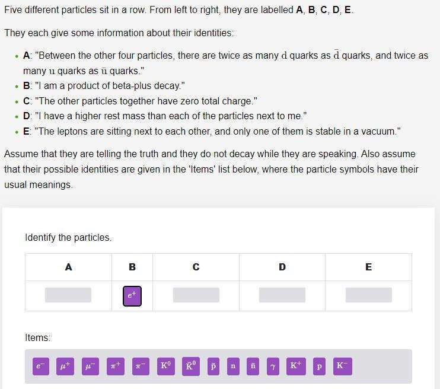

# puzzle-solver
Check if there's more than one solution to a physics puzzle.



There are!

```
Electron        Neutron         K-              Anti-K0         K+             
Positron        Neutron         K+              Anti-K0         K-             
Muon            Positron        Anti-K0         Proton          Pi-            
Pi+             Positron        Anti-Muon       Tau             Muon           
Pi-             Positron        Muon            Tau             Anti-Muon      
K0              Positron        Pi+             Neutron         K-             
K0              Neutron         Electron        K-              Pi+            
K0              Neutron         Positron        K-              Pi+            
K0              Neutron         Pi+             K-              Positron       
Anti-K0         Positron        Pi+             Neutron         K-             
Anti-K0         Neutron         Electron        K-              Pi+            
Anti-K0         Neutron         Positron        K-              Pi+            
Anti-K0         Neutron         Pi+             K-              Positron       
K-              Positron        Muon            Tau             Anti-Muon      
K-              Positron        Anti-K0         Proton          Pi-            
K+              Positron        Anti-Muon       Tau             Muon           
Proton          Positron        Anti-Muon       Tau             Muon           
Anti-Proton     Positron        Muon            Tau             Anti-Muon      
Anti-Proton     Positron        Anti-K0         Proton          Pi-            
Anti-Neutron    Positron        Pi+             Neutron         K-             
Anti-Neutron    Neutron         Electron        K-              Pi+            
Anti-Neutron    Neutron         Positron        K-              Pi+            
Anti-Neutron    Neutron         Pi+             K-              Positron       
Tau             Positron        Anti-K0         Proton          Pi-      
```